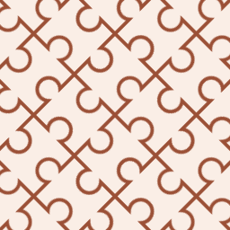
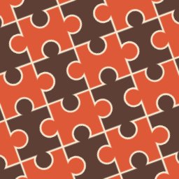

jigsaw.svg, stroke and fill, only two colors

jigsaw-v2.svg, stroke and two fill, three colors, but large

----

also a demo in misc/ dir, to play the [Elliptical Arc Curve](https://developer.mozilla.org/en-US/docs/Web/SVG/Attribute/d#elliptical_arc_curve)

